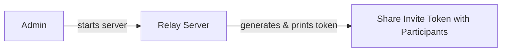
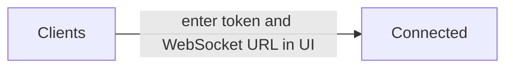
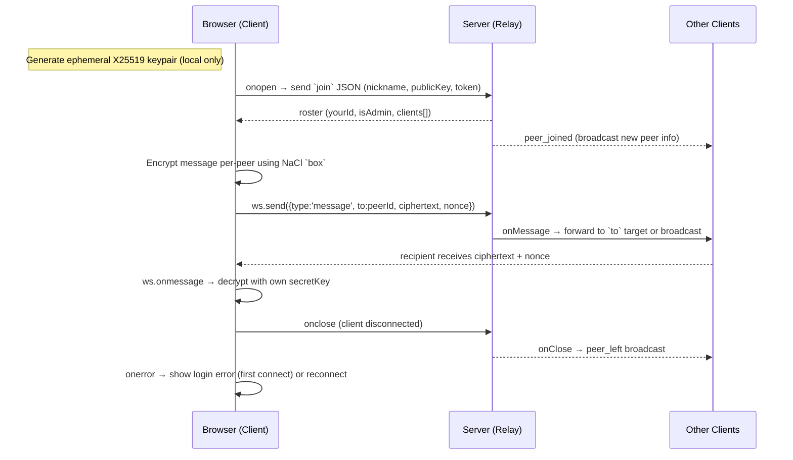

# End-to-End Encrypted Chat — Client-Side Encryption, Dumb Relay, No External Services
## Contents

- [Purpose](#purpose)
- [Setup & Usage Guide](#setup--usage-guide)
- [Architecture diagram](#architecture-diagram)
- [Things to look out for when using.](#things-to-look-out-for-when-using)
- [Future improvements](#future-improvements)

## Purpose

A minimal, end-to-end encrypted group chat using a dumb relay server. Clients send encrypted messages to the relay, which forwards them to intended recipients without ever seeing plaintext or private keys. This repository includes:

- A Relay server implemented in Java using `WebSocketServer` (hosted by one member of the group).
- A simple client UI in HTML/JS that connects to the relay (can be hosted or run locally).

The goal is to demonstrate a simple group chat where clients handle all encryption locally and do not rely on external services. This ensures all the chat data remains private between participants.

---

## Setup & Usage Guide

### For the Admin (Running the Relay Server)

The admin is responsible for hosting the relay server and sharing the invite token with participants out-of-band.

**Steps:**

1. Choose a host machine (a cloud VPS, big cloud provider, etc.)
2. Clone the repo and navigate to the `java-relay-server` directory.
3. Ensure Java (JDK) and Maven are installed.
4. Inside `relay.java`, adjust `MAX_USERS` if needed (default is 5).
5. Build the server: `mvn clean package`
6. Start the server: `java -jar target/relay-server-1.0.0.jar`
7. Share the invite token printed in the server logs with participants.

---

### For Participants (Connecting as a Client)

Each participant opens the client UI in their browser and connects using the invite token and WebSocket URL provided by the admin.

First, open the `ui/` directory locally using either Python or Node:

**Using Python:**
1. Change to the `ui` directory.
2. Run: `python3 -m http.server 3000`
3. Open `http://localhost:3000` in your browser.

**Using Node:**
1. Change to the `ui` directory.
2. Install live-server: `npm install -g live-server`
3. Run: `live-server --port=3000`
4. Open `http://localhost:3000` in your browser.

Once the UI is open, enter your nickname, the WebSocket URL (e.g. `wss://website.com:8080`), and the invite token to connect.

---

### Dependencies

| Component | Dependencies |
|---|---|
| **Server** | Java (JDK) + Maven; Java WebSocket implementation + `gson` (managed via Maven) |
| **Client** | `tweetnacl` and `tweetnacl-util` for browser-side crypto (load from CDN or bundle with a Node build) |
| **Local serving** | Python (`python3 -m http.server`) or Node (`live-server`) |

---

## Architecture diagram

Clients generate ephemeral X25519 keypairs locally using `tweetnacl` (`box`) — private keys never leave the browser. The relay only sees and forwards opaque Base64-encoded ciphertext + nonce blobs (XSalsa20-Poly1305 AEAD); it has no access to plaintext.

**How a session works, step by step:**

1. **Join** — On connect, the client sends `{type:'join', nickname, publicKey, token}`. The server validates the invite token (`INVITE_TOKEN`), enforces the `MAX_USERS` cap, assigns a `clientId` and `isAdmin` flag, returns a `roster` to the new client, and broadcasts `peer_joined` to everyone else.

2. **Messaging** — `sendMessage()` encrypts the payload separately for each peer, then sends `{type:'message', to, ciphertext, nonce}`. The server identifies the sender, applies rate limiting (`MIN_INTERVAL_MS`) and a 64 KB size cap, then forwards to the target socket or broadcasts via `broadcastMsg()`.

3. **Disconnect** — `ws.onclose` on the client triggers reconnect logic. On the server, `onClose()` removes the client, cleans all maps, and broadcasts `peer_left`. If the admin disconnects, a new admin is elected and `new_admin` is broadcast.

**Built-in protections:** The server validates that all required fields (`publicKey`, `ciphertext`, `nonce`) are present before processing (stops malformed requests).

**Where to look in code**

| Side | File | Key functions |
|---|---|---|
| Client | [ui/script.js](ui/script.js) | `connectToServer()`, `handleServerMessage()`, `sendMessage()`, `ws.onclose`, `ws.onerror` |
| Server | [java-relay-server/src/main/java/com/udpholepunch/relay.java](java-relay-server/src/main/java/com/udpholepunch/relay.java) | `onMessage()`, `handleJoin()`, `handleMessage()`, `onClose()`, `broadcastMsg()`, `safeSend()` |

**Event flow at a glance**

| Event | Client | Server |
|---|---|---|
| Connect | `ws.onopen` → send `join` | `handleJoin()` → reply `roster`, broadcast `peer_joined` |
| Message | `sendMessage()` → send encrypted payload | `onMessage()` → forward to target or broadcast |
| Disconnect | `ws.onclose` → reconnect attempts | `onClose()` → remove client, broadcast `peer_left` |
| Server message | `ws.onmessage` → `handleServerMessage()` dispatches on type | — |

---

## Things to look out for when using.
- Compare public keys in the user interface with out-of-band verification methods to confirm authenticity of the users you're communicating with.
- Ensure the relay runs on HTTPS/WSS; this is the operator's responsibility.
- The relay maintains user connections and stores associated public keys - something to be mindful of.
- Adjust server logs according to privacy requirements.
- Forward secrecy note: As long as clients and the server are not compromised, this provides forward secrecy — past sessions remain private; compromise during an active session still exposes that session.
- There is a message limit of 64 KB.
- Update max users accordingly in relay.java.
- The way this is currently set up, each relay server will simulate one chat room. 
- If you want to reset the invite token, simply restart the relay server. This will disconnect all clients and generate a new token for the next session.

---

## Future improvements

1. **Persist keys**: Use IndexedDB so identity survives refresh. Will require forward secrecy changes to avoid key reuse issues.
2. **Logging**: Avoid printing `INVITE_TOKEN` to public logs; show it only to the admin securely.
3. **Password protection**: Add a password on the login page as an additional security measure.
4. **Group encryption**: Implement a more efficient group encryption scheme (e.g. Signal's Sender Keys) to avoid encrypting separately for each peer.

