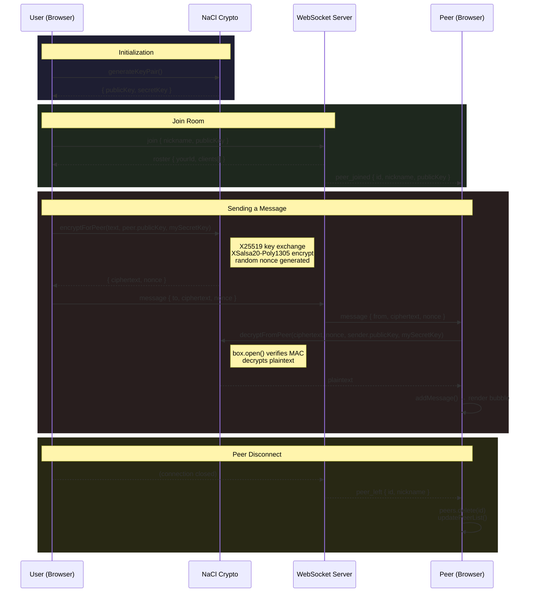

```mermaid
sequenceDiagram
    participant U as User (Browser)
    participant K as NaCl Crypto
    participant WS as WebSocket Server
    participant P as Peer (Browser)

    %% ── Initialization ──
    rect rgb(30, 30, 50)
        note over U,K: Initialization
        U->>K: generateKeyPair()
        K-->>U: { publicKey, secretKey }
    end

    %% ── Join ──
    rect rgb(30, 40, 30)
        note over U,WS: Join Room
        U->>WS: join { nickname, publicKey }
        WS-->>U: roster { yourId, clients[] }
        WS-->>P: peer_joined { id, nickname, publicKey }
    end

    %% ── Send Message ──
    rect rgb(40, 30, 30)
        note over U,P: Sending a Message
        U->>K: encryptForPeer(text, peer.publicKey, mySecretKey)
        note right of K: X25519 key exchange<br/>XSalsa20-Poly1305 encrypt<br/>random nonce generated
        K-->>U: { ciphertext, nonce }
        U->>WS: message { to, ciphertext, nonce }
        WS->>P: message { from, ciphertext, nonce }
        P->>K: decryptFromPeer(ciphertext, nonce, sender.publicKey, mySecretKey)
        note right of K: box.open() verifies MAC<br/>decrypts plaintext
        K-->>P: plaintext
        P->>P: addMessage() → render bubble
    end

    %% ── Disconnect ──
    rect rgb(40, 40, 20)
        note over U,P: Peer Disconnect
        U-->>WS: (connection closed)
        WS-->>P: peer_left { id, nickname }
        P->>P: peers.delete(id)<br/>updatePeerList()
    end
```